# Spend Circle v1 — Implementation Issue Graph

This is the **single map an agent follows** to build Spend Circle v1 on top of the
deep-module foundation (PR landing `arpitdalal/start-over`). Every remaining v1
capability is captured here as an independently-grabbable **vertical slice**. Read
this whole file once, then open the one slice file you are implementing.

Nothing here is busywork: each slice tells you **what** to build, **why** it must be
built that way (so you don't have to re-derive intent or ask), and **how to test it
comprehensively**. If a slice and an ADR ever disagree, the ADR wins — stop and flag it.

---

## 1. How to pick up a slice

1. **Read this file top to bottom.** The conventions and the testing bar (§4, §5) are
   non-negotiable and apply to every slice. Don't re-litigate them per slice.
2. **Open the slice file** (e.g. [`TXN-1`](TXN-1-create-transaction.md)). Read it fully.
3. **Read the referenced docs**: the PRD stories, the ADRs, and the `CONTEXT.md` glossary
   terms it names. These are the source of truth for behavior; the slice file summarizes
   intent but the glossary defines the words.
4. **Check the dependency graph (§3).** Do not start a slice whose dependencies are
   `Todo`. Its entry points won't exist yet.
5. **Implement test-first** (ADR 0006). Write the failing tests from the slice's "How to
   test" section first, then make them pass. Tests are the deliverable, not an afterthought.
6. **Run every gate** before opening a PR: `pnpm typecheck && pnpm lint && pnpm test && pnpm build && pnpm test:e2e`. All must be green.
7. **Open one PR per slice.** Title it `feat(<area>): <slice title>`, link the slice file,
   and list which PRD stories it closes. Keep the PR scoped to the slice — resist
   bundling the "next obvious thing."
8. **Right after the PR exists** (same agent session, same branch — not a later doc sweep on `main`):
   (a) set this slice’s Meta **Status** row to
   `Done · [PR #<n>](<full-pr-url>)` using the number and URL from `gh pr create` or
   `gh pr view --json url,number` (repo comes from `git remote`, same as `gh`);
   (b) if the GitHub issue does not already show the PR (e.g. missing `Closes`/`Ref` in the body),
   `gh issue comment <n> --body` with the PR URL;
   (c) commit and **push to the PR branch** so
   `docs/issues/<slice>.md` lands with the code. Goal: local slice file, open PR, and GitHub
   issue stay aligned — no follow-up "mark done + link PR" commit after merge.

---

## 2. Where things live (the file map)

A vertical slice cuts through these layers. Build them in this order so each layer's tests
can lean on the one below.

| Layer | Location | What goes here |
|---|---|---|
| Pure domain | `packages/domain/src/*.ts` | Currency, money (minor units), plain dates, refs, colors, Zod input schemas, validation constants. **No React, Convex, or browser imports** (PRD). |
| Schema | `packages/convex/convex/schema.ts` | Already complete for v1 — all tables/indexes exist. Add an index only if a slice's query needs one; never reshape a table without an ADR. |
| Backend model | `packages/convex/convex/model.ts` + new `*.ts` modules | Reusable mutation/query *logic* (the deep modules). Permission/lifecycle helpers in `guard.ts`; audit writes ONLY via `history.ts` `recordEvent`. |
| Convex functions | `packages/convex/convex/<area>.ts` | The `query`/`mutation` exports — the shared contract (ADR 0003). Thin handlers that compose model + guard + history. |
| View contract | `apps/web-app/app/lib/data.ts` | Derive each view type from the function via `FunctionReturnType` (never hand-write it — ADR 0003). Add a `useX()` hook with the MOCKS fork. |
| Mocks | `apps/web-app/app/lib/fixtures.ts` + `packages/mocks` | Fixtures for component/render tests + offline UI dev (`VITE_MOCKS`); MSW handlers for any new outbound vendor call (the only thing faked in E2E — ADR 0019). |
| Routing | `apps/web-app/app/routes.ts` + `routes/**` | Add object routes WITH their feature (see §4). Reuse `useResolvedRef` adapters. |
| UI | `apps/web-app/app/routes/**`, `components/**` | shadcn/ui + Tailwind + Recharts (ADR 0005). |

---

## 3. Dependency graph

`F0` = the shipped foundation (auth, Personal Circle bootstrap, `createCircle`/`renameCircle`,
`guard.ts`, `history.ts`, `useResolvedRef`, Circle view type). Everything below depends on it
transitively; only the **first non-obvious** dependency edges are drawn.

```mermaid
graph TD
  F0[F0 · Foundation ✅ shipped]

  %% Circles & Setup
  F0 --> CS0[CS-0 · Create Circle UI + switcher]
  CAT1 --> CS1[CS-1 · Circle Setup + starter categories]
  CS0 --> CS1
  CS0 --> CS2[CS-2 · Circle Settings: color/mark/setup]
  TXN1 --> CS3[CS-3 · Currency lock after first txn]
  CS0 --> CS4[CS-4 · Circle History view]

  %% Categories
  F0 --> CAT1[CAT-1 · Create Category]
  CAT1 --> CAT2[CAT-2 · Edit/Archive/Restore Category + history]
  CAT1 --> CAT3[CAT-3 · Inline Category create in txn form]
  TXN1 --> CAT3

  %% Transactions
  CAT1 --> TXN1[TXN-1 · Create Transaction]
  TXN1 --> TXN2[TXN-2 · Edit txn + type change]
  TXN1 --> TXN3[TXN-3 · Archive/Restore txn]
  TXN1 --> TXN4[TXN-4 · Txn detail: audit + history]

  %% Membership & Invitations
  F0 --> MEM1[MEM-1 · Member List]
  MEM1 --> MEM2[MEM-2 · Invite by email]
  MEM2 --> MEM3[MEM-3 · Accept Invitation + rejoin]
  MEM2 --> MEM4[MEM-4 · Manage invitations: resend/revoke]
  MEM1 --> MEM5[MEM-5 · Remove Member]
  MEM1 --> MEM6[MEM-6 · Leave Circle]
  MEM1 --> MEM7[MEM-7 · Transfer ownership]
  MEM4 --> MEM8[MEM-8 · Archive/Restore Circle]
  MEM2 --> MEM9[MEM-9 · Delete empty Circle]
  TXN1 --> MEM9

  %% Reporting
  TXN1 --> RPT1[RPT-1 · Monthly Ledger]
  TXN1 --> RPT2[RPT-2 · Search]
  RPT1 --> RPT2
  TXN1 --> RPT3[RPT-3 · Dashboard totals + Paid By]
  RPT3 --> RPT4[RPT-4 · Charts + comparison ranges]
  RPT3 --> RPT5[RPT-5 · Category analytics]
  RPT1 --> RPT6[RPT-6 · Dashboard drilldowns]
  RPT3 --> RPT6

  %% Notifications & Email
  F0 --> NTF1[NTF-1 · Notification Center]
  NTF1 --> NTF2[NTF-2 · Notification creation on events]
  F0 --> EML1[EML-1 · Resend + Welcome email]
  MEM2 --> EML2[EML-2 · Invitation email]
  EML1 --> EML2

  %% Quality / Validation
  TXN2 --> QA1[QA-1 · Concurrency e2e validation]
  TXN3 --> QA1
  MEM5 --> QA1

  %% Platform
  TXN1 --> EXP1[EXP-1 · CSV Export]
  EML1 --> FBK1[FBK-1 · Feedback]
  F0 --> SET1[SET-1 · Settings: version + opt-out]
  F0 --> OBS1[OBS-1 · Sentry]
  SET1 --> OBS2[OBS-2 · PostHog analytics]
```

### Build order (tiers — within a tier, slices are parallelizable)

- **Tier 1 — make a Circle useful:** `CAT-1` → `TXN-1`. Then `CS-0`, `MEM-1`, `SET-1`,
  `OBS-1`, `EML-1`, `NTF-1` (all only need `F0`).
- **Tier 2 — manage what exists:** `CAT-2`, `CAT-3`, `TXN-2`, `TXN-3`, `TXN-4`, `CS-1`,
  `CS-2`, `CS-3`, `RPT-1`, `RPT-3`, `EXP-1`, `FBK-1`, `OBS-2`.
- **Tier 3 — collaborate + report:** `MEM-2…9`, `RPT-2`, `RPT-4`, `RPT-5`, `RPT-6`,
  `EML-2`, `CS-4`.
- **Tier 4 — wire the cross-cutting net + validate under load:** `NTF-2` (fans out to every
  event emitted by the slices above) and `QA-1` (concurrency e2e; needs `TXN-2` + `TXN-3` for the
  archive-vs-edit race, and `MEM-5` for the Paid-By-removed-mid-edit race). Both run last.

---

## 4. Conventions every slice MUST follow

These encode decisions already made. Following them is what keeps the codebase deep and
scalable; breaking them is a review blocker.

**v1 ships to real test users at production quality.** You may defer *scope* — a capability
that genuinely belongs to a later slice — but you may never defer *quality*: correctness,
security, scale, error handling, and accessibility hold at v1 exactly as they would at GA.
"It's only v1," "no real users yet," or "fine for current volume" is **not** a valid reason
to cut any corner below. If a quality dimension truly can't be met within a slice, say so
explicitly in the PR and flag it — never skip it silently.

- **Permissions are server-side, always (ADR 0015).** Every mutation/query resolves access
  through `requireCircleAccess` / `resolveCircleAccess` (`guard.ts`). The UI hiding a button
  is never the enforcement; it's a courtesy on top of the server check. Entity-level checks
  (Recorded By, Category creator, Owner-moderation) compose **over** `requireCircleAccess`
  per the `requireTransactionAccess` shape documented in `guard.ts` — reuse it, don't
  re-derive membership inline.
- **Anti-enumeration (ADR 0016).** Missing and inaccessible are indistinguishable: same
  `"Circle not found"` throw on mutations, same `null` from resolver queries, same
  unavailable-link snackbar + fallback in the UI. Never leak whether an object exists.
- **Audit on every change (ADR 0018, ADR 0021).** Any mutation that changes an audited entity
  (Circle, Transaction, Category — incl. membership/ownership/lifecycle events) MUST call
  `recordEvent` with display-safe values (money as typed minor units plus Currency, dates
  plain `YYYY-MM-DD`, Members as Display Name, Categories as names — never raw IDs). This
  holds **even when that entity's history *view* ships in a later slice** — write the events
  now so the view has data when it lands.
- **Derive view types across the seam (ADR 0003).** New client-facing shape ⇒ a Convex
  function returns it ⇒ derive the type with `FunctionReturnType` in `data.ts`. Never
  hand-write a parallel `interface` for a mocked path; that's the drift this foundation
  removed.
- **Every new query gets a mock path (ADR 0006).** Add a fixture in `fixtures.ts` and the
  `MOCKS ? fixture : useQuery(...)` fork in the `useX()` hook, with `"skip"` on the real
  query under MOCKS. Fixtures power the fast component/render tests and offline UI dev
  (`VITE_MOCKS`); they are **not** the E2E surface — E2E runs against a real self-hosted
  Convex backend (ADR 0019).
- **Object routes land with their feature, not before.** When a slice needs
  `/circles/:circleRef/transactions/:transactionRef` (or `…/categories/:categoryRef`), add
  the route AND its `useResolvedRef` adapter together — the first one instantiates the
  object-guard pattern described in `use-resolved-ref.ts` and `guard.ts`. No caller-less
  placeholder routes.
- **Queries are scalable and paginated from day one.** v1 ships to real test users, not a
  personal dataset — every query must stay bounded under load. Any query over an
  unbounded-growth set (Transactions, Categories, Members, History, Notifications, search
  results) MUST paginate **at the source** via Convex `paginate` over an appropriate index —
  never `.collect()` a whole table/range and slice in memory, and never lean on "v1 volume is
  small." Reads are index-backed (add the index in `schema.ts` if missing); aggregates
  (totals, counts, analytics) are computed over bounded/indexed ranges, not by scanning every
  row. "Good enough for v1" is not a reason to ship an unbounded query — if a slice genuinely
  cannot paginate, say why in the PR, don't skip it silently.
- **Reads are index-backed and batch-aware.** Query via `.withIndex(...)`; never `.filter()`
  over an unbounded range (it scans every row). Resolve related data (a Transaction's
  Categories and Paid By, a Member's User, etc.) by batching over an index, **not** a `.get()`
  per row inside a loop — no N+1. This holds at v1 volume too; a small dataset is not a license
  to fan out per-row reads.
- **Domain logic is pure and shared.** Money/date/currency/validation logic goes in
  `packages/domain` (testable with zero mocks) and is imported by both backend and UI.
  Don't reimplement amount parsing or date bucketing in a handler.
- **No silent failures.** A `catch` either handles a *known* outcome the form already mirrors,
  or surfaces the unexpected one (console now, Sentry once it lands — ADR 0012) — it never
  swallows. User-facing errors get a visible, accessible message (`role="alert"`); failures are
  never logged-and-ignored or dropped into an empty `catch {}`.
- **Every read surface handles all states — loading, empty, and error — not just the populated
  happy path.** Mutations disable their trigger while in-flight and guard against double-submit.
- **Accessible by default** (the ADR 0005 reason for shadcn/Radix). Inputs have associated
  labels, interactive non-`<button>` elements carry correct roles/`aria-*`, validation errors
  use `role="alert"`, and every surface is keyboard-operable. Accessibility is part of the
  slice, not a later cleanup.
- **Money is integer minor units (ADR 0009); dates are plain strings, no timezone (PRD).**
- **Secrets only in platform env vars.** No keys in code or committed env files.
- **Rate-limited actions enforce limits server-side** (see the specific caps in MEM-4,
  EML-1, FBK-1).

---

## 5. The testing bar (applies to EVERY slice)

Test-first is a project constraint (ADR 0006). "Tests pass" means **comprehensive** tests
pass — happy paths alone are a review rejection. For each slice, cover:

1. **Happy path** — the intended action succeeds and persists the right state.
2. **Input edge cases** — empty/whitespace, boundary values (e.g. amount `0`,
   `999_999_999.99`, one minor unit over max, 3-decimal input), wrong type, missing
   required field, oversized strings, duplicates, case-only differences.
3. **Permission matrix** — run the action as each relevant actor and assert allow/deny.
   The standard actors to consider (include the ones the slice touches):
   `Owner`, `non-owner Member`, `Recorded By`, `non-creator Member`, `Category creator`,
   `Removed Member`, `non-member User`, `unauthenticated`, `Personal Circle owner`.
4. **Lifecycle/state edges** — action against an `archived` Circle, `archived` Transaction,
   `archived` Category; on a Personal Circle (which forbids invite/archive/delete/leave/
   transfer); after the relevant lock (e.g. Currency locked once a Transaction exists).
5. **Invariants hold** — uniqueness (Category name per Circle+type, case-insensitive, incl.
   archived), exactly one Member row per (Circle, User), ≥1 Category per Transaction, no
   duplicate Categories, single Owner, Personal Circle stays solo.
6. **History/audit** — assert the mutation recorded the expected event(s) with correct
   `action`, display-safe `from`/`to` values, actor, typed money where relevant, and **no raw
   IDs** in `changes`.
7. **Live-update relevance** — where the PRD promises live read-only/revocation (e.g.
   archived-live, removed-live), assert the query result flips when the underlying row
   changes (convex-test: mutate, re-query).
8. **Anti-enumeration** — missing vs inaccessible produce the identical observable result.
9. **Mock parity** — the mock fixture shape matches the derived view type (typecheck
   enforces it; add a render/route test where behavior differs under MOCKS).
10. **Scalability** — any list/search/history query asserts it paginates: seed past one page,
    assert the first page is bounded and `continueCursor` returns the next page (no full-set
    `.collect()`). Aggregates assert correctness over a multi-page dataset.
11. **Regression** — any bug fixed while building the slice gets a test that fails before
    the fix (ADR 0006).

**Test placement:** pure domain → `packages/domain/src/*.test.ts`. Backend functions,
permissions, lifecycle, rate limits, history → `packages/convex/convex/*.test.ts`
(convex-test; mock the `./auth.js` seam via `vi.mock` as in `guard.test.ts` since Better
Auth can't run under convex-test). UI hooks/state machines → `apps/web-app/app/**/*.test.ts`
(renderHook + `vi.mock`). Critical flows → `e2e/*.spec.ts` (Playwright against a real
self-hosted Convex backend — ADR 0019; OAuth replaced by the `E2E_TEST_AUTH` email/password
bypass, vendors intercepted by MSW; desktop + mobile viewports).

---

## 6. Slice file template

Each slice file in this directory uses this structure:

- **Meta** — Status (`Todo` while in flight; once a PR exists, `Done · [PR #n](url)` and keep
  that commit on the PR branch — §1 step 8) · Labels · Depends on · Unlocks · PRD stories ·
  ADRs · Glossary terms.
- **Intent** — the product reasoning. Why this exists and the non-obvious "why it works
  this way." Enough that you don't need to ask.
- **Implement** — concrete work per layer, with file paths and the deep-module patterns to
  reuse.
- **Why this way** — constraints, gotchas, the traps to avoid.
- **How to test** — the comprehensive list specialized to this slice (on top of §5).
- **Done when** — the acceptance checklist.
- **Out of scope** — what explicitly belongs to a different slice.

---

## 7. Index

### Circles & Setup
- [CS-0 · Create Circle UI + switcher](CS-0-create-circle-ui.md)
- [CS-1 · Circle Setup + starter Categories + Currency confirm](CS-1-circle-setup.md)
- [CS-2 · Circle Settings: Color, Mark, Setup answers](CS-2-circle-settings.md)
- [CS-3 · Currency lock after first Transaction](CS-3-currency-lock.md)
- [CS-4 · Circle History view](CS-4-circle-history-view.md)

### Categories
- [CAT-1 · Create Category](CAT-1-create-category.md)
- [CAT-2 · Edit / Archive / Restore Category + Category History](CAT-2-category-lifecycle.md)
- [CAT-3 · Inline Category create in Transaction form](CAT-3-inline-category.md)

### Transactions
- [TXN-1 · Create Transaction](TXN-1-create-transaction.md)
- [TXN-2 · Edit Transaction + Type Change](TXN-2-edit-transaction.md)
- [TXN-3 · Archive / Restore Transaction](TXN-3-archive-transaction.md)
- [TXN-4 · Transaction detail: Audit Metadata + History](TXN-4-transaction-detail.md)

### Membership & Invitations
- [MEM-1 · Member List](MEM-1-member-list.md)
- [MEM-2 · Invite by email](MEM-2-invite.md)
- [MEM-3 · Accept Invitation + rejoin](MEM-3-accept-invitation.md)
- [MEM-4 · Manage Invitations: resend / revoke](MEM-4-manage-invitations.md)
- [MEM-5 · Remove Member](MEM-5-remove-member.md)
- [MEM-6 · Leave Circle](MEM-6-leave-circle.md)
- [MEM-7 · Transfer ownership](MEM-7-transfer-ownership.md)
- [MEM-8 · Archive / Restore Circle](MEM-8-archive-circle.md)
- [MEM-9 · Delete empty Circle](MEM-9-delete-circle.md)

### Reporting
- [RPT-1 · Monthly Ledger](RPT-1-monthly-ledger.md)
- [RPT-2 · Search](RPT-2-search.md)
- [RPT-3 · Dashboard totals + Paid By filter](RPT-3-dashboard-totals.md)
- [RPT-4 · Dashboard charts + comparison ranges](RPT-4-dashboard-charts.md)
- [RPT-5 · Category analytics](RPT-5-category-analytics.md)
- [RPT-6 · Dashboard drilldowns](RPT-6-dashboard-drilldowns.md)

### Notifications & Email
- [NTF-1 · Notification Center](NTF-1-notification-center.md)
- [NTF-2 · Notification creation on events](NTF-2-notification-events.md)
- [EML-1 · Resend integration + Welcome email](EML-1-welcome-email.md)
- [EML-2 · Invitation email](EML-2-invitation-email.md)

### Platform
- [MNT-1 · React Router v8 future flag adoption](MNT-1-react-router-v8-flags.md)
- [MNT-2 · Locale-safe money formatting](MNT-2-locale-safe-money-formatting.md)
- [EXP-1 · CSV Export](EXP-1-csv-export.md)
- [FBK-1 · Feedback](FBK-1-feedback.md)
- [SET-1 · Settings: App Version + analytics opt-out](SET-1-settings.md)
- [OBS-1 · Sentry error monitoring](OBS-1-sentry.md)
- [OBS-2 · PostHog product analytics](OBS-2-posthog.md)

### Quality / Validation
- [QA-1 · Concurrent-modification e2e validation](QA-1-concurrency-validation.md)
</content>
</invoke>
